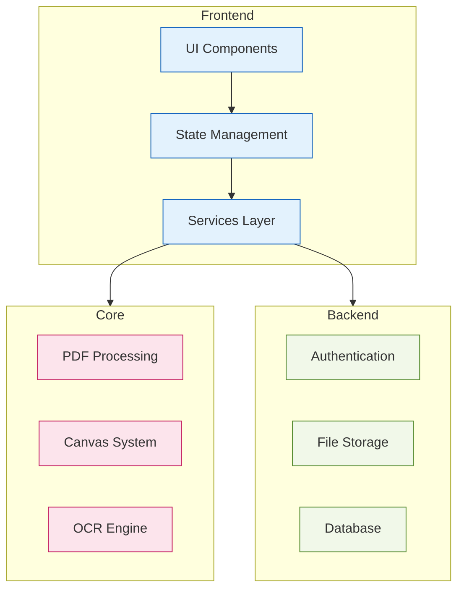
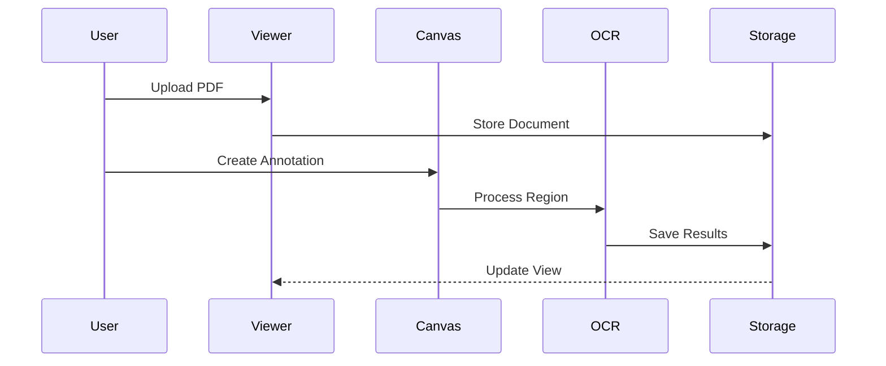
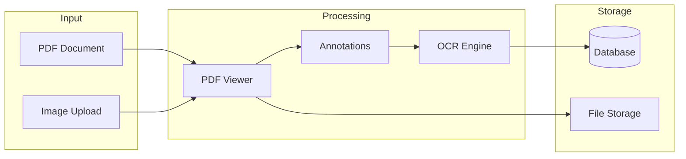
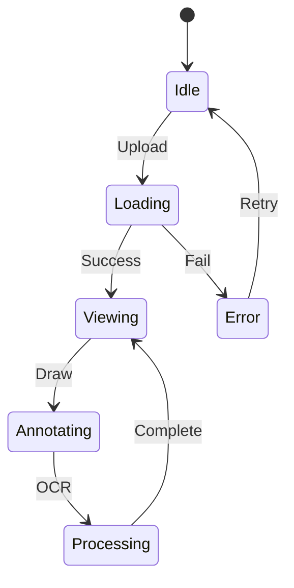

# Application Architecture

## System Overview

```mermaid
graph TB
    subgraph Frontend
        UI[UI Components]
        State[State Management]
        Services[Services Layer]
    end
    
    subgraph Core
        PDF[PDF Processing]
        Canvas[Canvas System]
        OCR[OCR Engine]
    end
    
    subgraph Backend
        Auth[Authentication]
        Storage[File Storage]
        DB[Database]
    end
    
    UI --> State
    State --> Services
    Services --> Core
    Services --> Backend
    
    classDef frontend fill:#e3f2fd,stroke:#1565c0
    classDef core fill:#fce4ec,stroke:#c2185b
    classDef backend fill:#f1f8e9,stroke:#558b2f
    
    class UI,State,Services frontend
    class PDF,Canvas,OCR core
    class Auth,Storage,DB backend
```

## Component Interaction

```mermaid
sequenceDiagram
    participant U as User
    participant V as Viewer
    participant C as Canvas
    participant O as OCR
    participant S as Storage
    
    U->>V: Upload PDF
    V->>S: Store Document
    U->>C: Create Annotation
    C->>O: Process Region
    O->>S: Save Results
    S-->>V: Update View
```

## Data Flow

```mermaid
flowchart LR
    subgraph Input
        PDF[PDF Document]
        IMG[Image Upload]
    end
    
    subgraph Processing
        View[PDF Viewer]
        Ann[Annotations]
        OCR[OCR Engine]
    end
    
    subgraph Storage
        DB[(Database)]
        FS[File Storage]
    end
    
    PDF --> View
    IMG --> View
    View --> Ann
    Ann --> OCR
    OCR --> DB
    View --> FS
```

## State Management

```mermaid
stateDiagram-v2
    [*] --> Idle
    Idle --> Loading: Upload
    Loading --> Viewing: Success
    Loading --> Error: Fail
    Viewing --> Annotating: Draw
    Annotating --> Processing: OCR
    Processing --> Viewing: Complete
    Error --> Idle: Retry
```