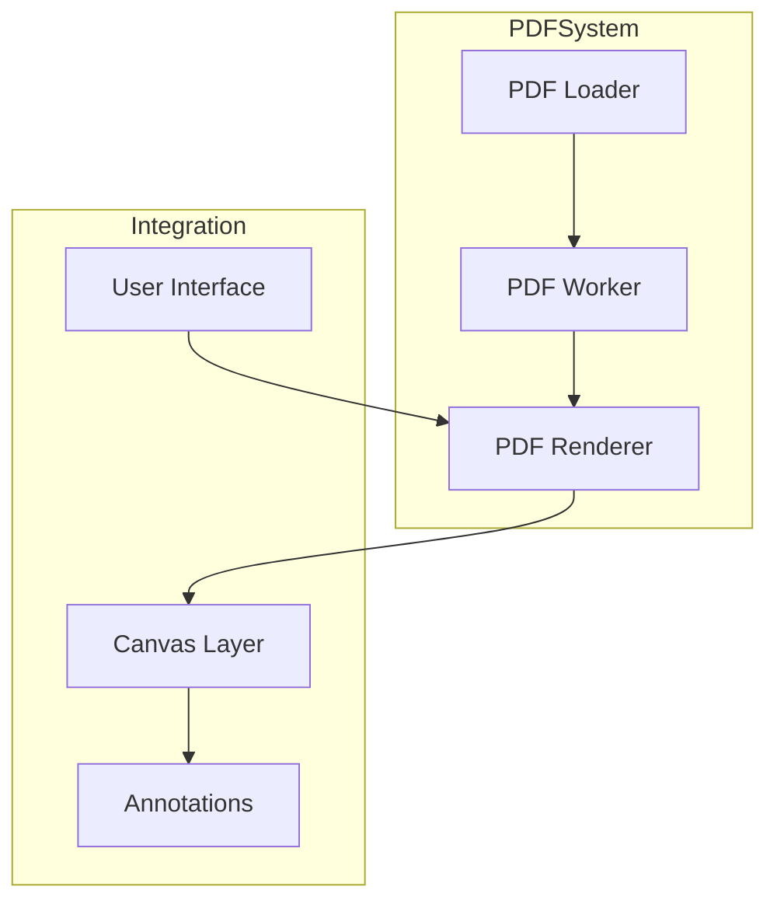

# PDF Processing System

## Overview
The PDF processing system handles document loading, rendering, and manipulation using PDF.js. It includes features for page navigation, zooming, rotation, and annotation integration.

## Architecture

### Core Components



## Implementation

### 1. PDF Initialization

```typescript
// services/pdf/initialization.ts
import { GlobalWorkerOptions } from 'pdfjs-dist';
import * as pdfjsLib from 'pdfjs-dist';

// Configure worker
GlobalWorkerOptions.workerSrc = '/assets/pdf.worker.js';

// PDF viewer options
export const PDF_OPTIONS = {
  cMapUrl: '/assets/cmaps/',
  cMapPacked: true,
  standardFontDataUrl: '/assets/standard_fonts/',
  useWorkerFetch: false,
  isEvalSupported: false,
  useSystemFonts: false,
  disableAutoFetch: false,
  disableStream: false,
  disableFontFace: false
};

export const pdfjs = pdfjsLib;
```

### 2. PDF Viewer Component

```typescript
// components/PdfViewer.tsx
interface PdfViewerProps {
  file: File;
  scale: number;
  rotation: number;
  onPageLoad: (dimensions: { width: number; height: number }) => void;
}

export function PdfViewer({ file, scale, rotation, onPageLoad }: PdfViewerProps) {
  const [numPages, setNumPages] = useState(1);
  const [dimensions, setDimensions] = useState({ width: 0, height: 0 });
  
  const handleDocumentLoad = ({ numPages }: { numPages: number }) => {
    setNumPages(numPages);
  };

  const handlePageLoad = (page: any) => {
    const viewport = page.getViewport({ scale: 1, rotation });
    const dimensions = {
      width: viewport.width,
      height: viewport.height
    };
    setDimensions(dimensions);
    onPageLoad(dimensions);
  };

  return (
    <Document
      file={file}
      onLoadSuccess={handleDocumentLoad}
      options={PDF_OPTIONS}
    >
      <Page
        pageNumber={1}
        scale={scale}
        rotate={rotation}
        onLoadSuccess={handlePageLoad}
        renderTextLayer={false}
        renderAnnotationLayer={false}
      />
    </Document>
  );
}
```

### 3. PDF Processing Service

```typescript
// services/pdf/processor.ts
interface ProcessOptions {
  scale?: number;
  rotation?: number;
  quality?: number;
}

export class PDFProcessor {
  private document: PDFDocumentProxy | null = null;

  async loadDocument(file: File): Promise<void> {
    const arrayBuffer = await file.arrayBuffer();
    this.document = await pdfjs.getDocument({
      data: arrayBuffer,
      ...PDF_OPTIONS
    }).promise;
  }

  async getPage(pageNumber: number): Promise<PDFPageProxy> {
    if (!this.document) {
      throw new Error('Document not loaded');
    }
    return this.document.getPage(pageNumber);
  }

  async renderPage(
    page: PDFPageProxy,
    canvas: HTMLCanvasElement,
    options: ProcessOptions = {}
  ): Promise<void> {
    const viewport = page.getViewport({
      scale: options.scale || 1,
      rotation: options.rotation || 0
    });

    const context = canvas.getContext('2d');
    if (!context) throw new Error('Cannot get canvas context');

    canvas.width = viewport.width;
    canvas.height = viewport.height;

    await page.render({
      canvasContext: context,
      viewport
    }).promise;
  }

  async getPageText(page: PDFPageProxy): Promise<string> {
    const textContent = await page.getTextContent();
    return textContent.items
      .map(item => 'str' in item ? item.str : '')
      .join(' ');
  }
}
```

### 4. PDF Utilities

```typescript
// utils/pdf.ts
export const validatePDFFile = async (file: File): Promise<boolean> => {
  if (file.type !== 'application/pdf') {
    return false;
  }

  try {
    const arrayBuffer = await file.arrayBuffer();
    const firstBytes = new Uint8Array(arrayBuffer.slice(0, 5));
    const pdfHeader = String.fromCharCode(...firstBytes);
    return pdfHeader === '%PDF-';
  } catch (error) {
    console.error('PDF validation error:', error);
    return false;
  }
};

export const getPageDimensions = (
  page: PDFPageProxy
): { width: number; height: number } => {
  const viewport = page.getViewport({ scale: 1.0 });
  return {
    width: viewport.width,
    height: viewport.height
  };
};
```

## Best Practices

### Memory Management
1. Dispose of PDF documents when no longer needed
2. Clean up canvas elements
3. Manage worker lifecycle

```typescript
// Example cleanup
useEffect(() => {
  return () => {
    if (pdfDocument) {
      pdfDocument.destroy();
    }
    if (pdfWorker) {
      pdfWorker.destroy();
    }
  };
}, []);
```

### Performance Optimization
1. Lazy loading of pages
2. Canvas reuse
3. Worker management

```typescript
// Example lazy loading
const loadPage = async (pageNumber: number) => {
  if (!visiblePages.includes(pageNumber)) {
    return;
  }
  const page = await getPage(pageNumber);
  await renderPage(page);
};
```

### Error Handling

```typescript
// Example error handling
try {
  await loadPDF(file);
} catch (err) {
  if (err instanceof InvalidPDFError) {
    // Handle invalid PDF
  } else if (err instanceof LoadError) {
    // Handle loading error
  } else {
    // Handle other errors
  }
}
```

## Integration with Annotations

### Canvas Coordination
1. Synchronize PDF and annotation layers
2. Handle scaling and rotation
3. Coordinate transformations

```typescript
// Example coordinate transformation
const transformCoordinates = (
  point: { x: number; y: number },
  scale: number,
  rotation: number
): { x: number; y: number } => {
  // Transform coordinates based on scale and rotation
  const rad = (rotation * Math.PI) / 180;
  return {
    x: (point.x * Math.cos(rad) - point.y * Math.sin(rad)) * scale,
    y: (point.x * Math.sin(rad) + point.y * Math.cos(rad)) * scale
  };
};
```

## Testing

### Unit Tests
```typescript
describe('PDFProcessor', () => {
  it('should load PDF document', async () => {
    const processor = new PDFProcessor();
    await processor.loadDocument(testFile);
    expect(processor.document).toBeTruthy();
  });

  it('should render page correctly', async () => {
    // Test page rendering
  });

  it('should handle errors gracefully', async () => {
    // Test error handling
  });
});
```