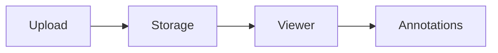
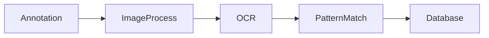

# Construction Plan Viewer Documentation

## Overview
The Construction Plan Viewer is a web application that allows users to view, annotate, and extract material schedules from construction plans. The application uses OCR (Optical Character Recognition) to automatically identify and catalog materials from annotations.

## Architecture

### Core Technologies
- **Frontend**: React with TypeScript
- **State Management**: Zustand
- **Database**: Supabase
- **PDF Processing**: PDF.js
- **Canvas Manipulation**: Fabric.js
- **OCR**: Tesseract.js

### Directory Structure
```
src/
├── components/           # Reusable UI components
├── features/            # Feature-specific modules
├── hooks/               # Custom React hooks
├── services/           # External service integrations
├── stores/             # State management
├── types/              # TypeScript type definitions
└── utils/              # Utility functions
```

## Features

### 1. Document Management
- Upload and manage construction plans
- Support for PDF and image formats
- Document version control
- Secure storage in Supabase

### 2. Annotation System
- Box annotations for marking areas
- Real-time canvas manipulation
- Annotation persistence
- Multi-user collaboration support

### 3. OCR Processing
- Text extraction from annotations
- Image preprocessing for improved accuracy
- Configurable OCR settings
- Pattern matching for material identification

### 4. Material Scheduling
- Automatic tag pattern recognition
- Material schedule generation
- Export capabilities
- Data validation and verification

## Key Components

### PDF Viewer
```typescript
// features/materialSchedule/components/PdfViewer.tsx
- Handles PDF rendering and navigation
- Manages document scaling and rotation
- Integrates with annotation system
```

### Annotation Canvas
```typescript
// features/materialSchedule/components/annotations/canvas/AnnotationCanvas.tsx
- Provides drawing capabilities
- Manages annotation interactions
- Handles coordinate transformations
```

### OCR Processing
```typescript
// features/materialSchedule/services/ocr/ocrProcessor.ts
- Manages Tesseract.js worker
- Handles text recognition
- Processes image data
```

### Tag Pattern System
```typescript
// features/materialSchedule/components/patterns/
- Manages material tag patterns
- Links annotations to patterns
- Handles pattern matching
```

## State Management

### Stores
1. **AnnotationStore**
   - Manages annotation state
   - Handles CRUD operations
   - Syncs with Supabase

2. **ViewerStore**
   - Controls viewer state
   - Manages zoom and rotation
   - Handles tool selection

3. **TagPatternStore**
   - Manages tag patterns
   - Handles pattern matching
   - Stores recognition rules

## Data Flow

1. **Document Upload**


2. **OCR Processing**


## API Integration

### Supabase Tables
1. **documents**
   - Stores document metadata
   - Manages file references
   - Tracks versions

2. **annotations**
   - Stores annotation data
   - Links to documents
   - Contains OCR results

3. **tag_patterns**
   - Defines recognition patterns
   - Stores material definitions
   - Links to annotations

## Security

### Authentication
- Supabase authentication
- Protected routes
- Session management

### Authorization
- Role-based access control
- Document-level permissions
- Feature access control

## Performance Optimization

### Image Processing
- Efficient canvas operations
- Optimized OCR preprocessing
- Caching strategies

### State Management
- Normalized data structures
- Efficient updates
- Batched operations

## Error Handling

### OCR Processing
```typescript
try {
  const result = await recognizeText(imageData);
  // Handle success
} catch (err) {
  // Log error
  // Show user-friendly message
  // Provide retry options
}
```

### Network Operations
- Retry mechanisms
- Error recovery
- User feedback

## Testing

### Unit Tests
- Component testing
- Service testing
- Utility function testing

### Integration Tests
- Feature testing
- API integration testing
- State management testing

## Development Workflow

### Setup
```bash
# Install dependencies
npm install

# Start development server
npm run dev

# Build for production
npm run build
```

### Environment Variables
```env
VITE_SUPABASE_URL=your_supabase_url
VITE_SUPABASE_ANON_KEY=your_anon_key
```

## Deployment

### Build Process
1. Compile TypeScript
2. Bundle assets
3. Optimize images
4. Generate service worker

### Production Considerations
- Environment configuration
- Performance monitoring
- Error tracking
- Analytics integration

## Troubleshooting

### Common Issues
1. OCR accuracy problems
   - Check image preprocessing
   - Verify pattern configuration
   - Validate input quality

2. Performance issues
   - Monitor canvas operations
   - Check memory usage
   - Optimize state updates

### Debugging
- Comprehensive logging
- Performance profiling
- Error tracking

## Future Improvements

### Planned Features
1. Batch OCR processing
2. Advanced pattern matching
3. Export customization
4. Collaboration features

### Technical Debt
- Code organization
- Test coverage
- Documentation updates